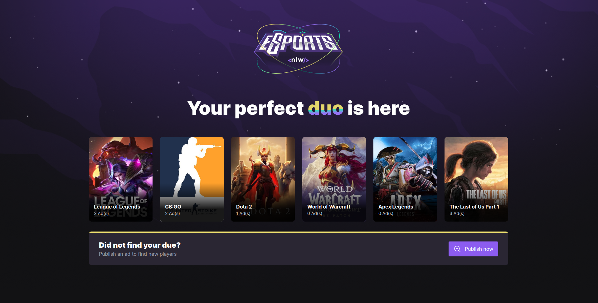
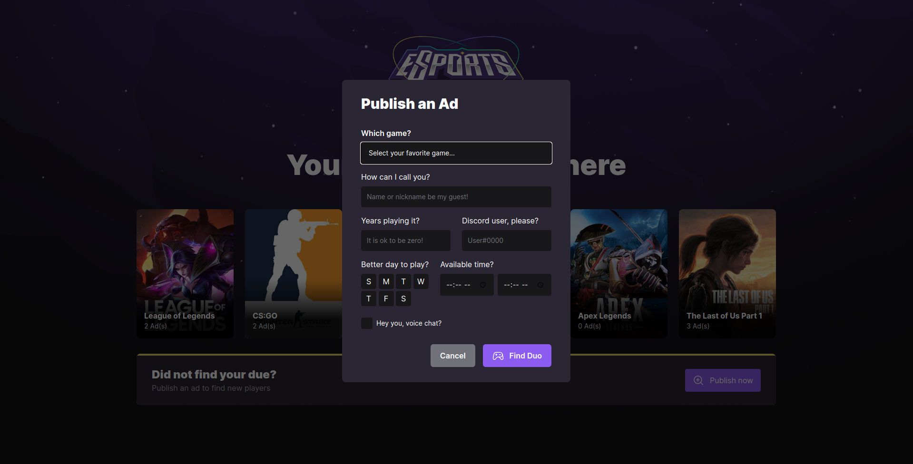

<p align="center">
    
</p>


<p align="center">
  <a href="#rocket-tecnologias">Tecnologias</a>&nbsp;&nbsp;&nbsp;|&nbsp;&nbsp;&nbsp;
  <a href="#-projeto">Projeto</a>&nbsp;&nbsp;&nbsp;|&nbsp;&nbsp;&nbsp;
  <a href="#-layout">Layout</a>&nbsp;&nbsp;&nbsp;|&nbsp;&nbsp;&nbsp;
</p>
<br>

<p align="center">
  
  
  
</p>

<p align="center">
  
  
  
</p>

<p align="center">
  
  
  
  
</p>
## 🚀 Technologies ##

This project was developed using the following technologies:

- [React](https://pt-br.reactjs.org/)
- [Vite](https://vitejs.dev/)
- [TypeScript](https://www.typescriptlang.org/)
- [Prisma](https://www.prisma.io/)
- [Express](https://expressjs.com/)
- [Expo](https://docs.expo.dev/)
- [Tailwind](https://tailwindcss.com/)
- [Radix](https://www.radix-ui.com/)
- [Phosphor](https://phosphoricons.com/)
<br>

---

## 📋  Requirements ##

Before starting you need :checkered_flag:, have installed the [Git](https://git-scm.com) e [Node](https://nodejs.org/en/).

<br>

---
## ⌨ How to run the project ##

```bash
# Clone this project
$ git clone git@github.com:Ca-byte/nlw_e_sports.git

# Access
$ cd nlwesport/web
$ cd nlwesport/mobile
$ cd nlwesport/server

# Install dependencies
$ npm i

# Run the project

# web/server
$ npm run dev

# mobile
$ expo start

# The server will initialize in the <http://localhost:5173/>

```
<br>

---

## 💻 Project

We create a web and Mobile app that you are able to find your game duo, yes, it is what you read, you know when you have time and days free to enjoy you favorite game but you don't have a partner to do it, so this days are ended. Web app you can complete the form while you can find your perfect duo on mobile app and even receive a push notification.
Are you excited? So here you go!

This is a project developed during  **[NLW eSports](https://lp.rocketseat.com.br/inscricao/ignite-lab/)**, run by **[@Rocketseat](https://github.com/Rocketseat)** during september 11 to 18 2022.

<br>

---

## 🔖 Layout ##

You can view the layout of the project through the links below:
- [NLW eSports](https://www.figma.com/file/G3yUj4V8ZAFIKYvmrAuvhz/NLW-eSports-(Community))

Remembering that you need to have a [Figma](http://figma.com/) account to access it.

---

<br>

<p align="center">Developed with 💜 by Caroline Vieira</p>
